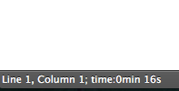

sublime-timer
=============

This is the plugin which achieve the function of timer .  
Test under version 3 of sublime .  
You can see the effect picture below .  

### How to user
1.put the file "sublime-timer" in Preferens-Brows Packages  
2."control+alt+t": start timer  
3."control+alt+p": pause or stop timer  
4."control+alt+z": make zero
